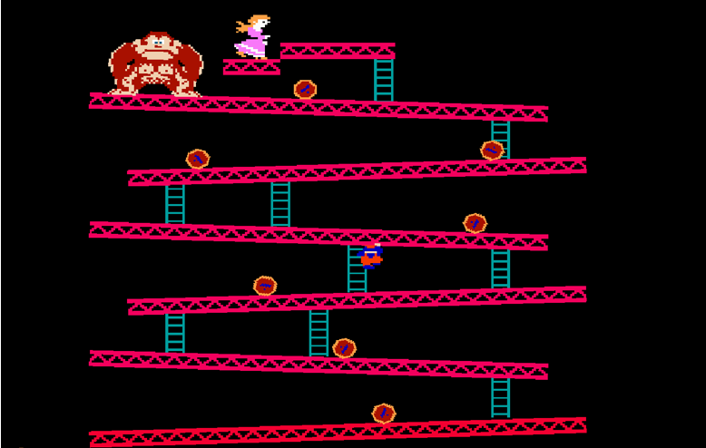
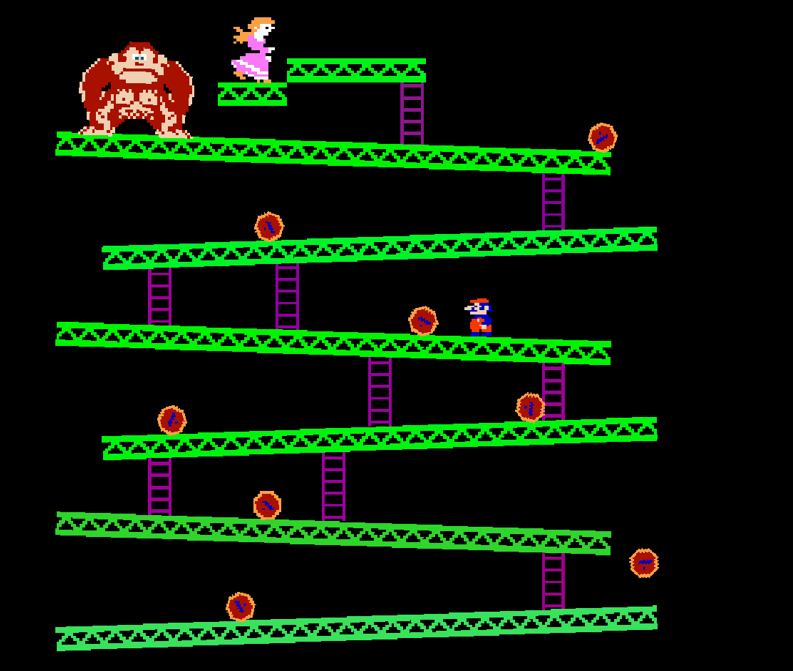

# 🎮 Donkey Kong Game - Unity Project

This is a 2D recreation of the **classic Donkey Kong arcade game**, originally released by Nintendo in **1981*, which I developed using **Unity** and **C#**. This project captures the core gameplay mechanics of the original — including platform climbing, obstacle avoidance, and level progression — while applying modern game development practices such as physics simulation, scripting, and modular design. Built as part of an academic micro-project, it serves both as a nostalgic tribute and a learning milestone in 2D game development.

## 📽️ Gameplay Demo Video

<video src="media/gameVideo.mp4" controls width="100%"></video>

> _Note: If the video doesn't play in preview, [download it here](media/gameVideo.mp4) and play locally, view the screenshots below._

## 🎮 Game Features

- 👾 Player movement: walk, jump, climb ladders
- 🔥 Rolling barrels as obstacles
- ⭐ Score & lives tracking
- ⏫ Level progression with increasing difficulty
- 🎮 Classic platformer experience

## 🛠️ Built With

- Unity 2019.4 LTS or later
- C# (Visual Studio Community 2019+)
- Unity Asset Store (for game assets)

## 📂 Project Components

`Player.cs`    --> Controls movement, jumping, and ladder climbing.  
`Barrel.cs`    --> Controls enemy barrels behavior and physics.  
`Spawner.cs`   --> Spawns barrels dynamically.  
`GameManager.cs` --> Handles game state, levels, score, and lives.  

## 🕹️ How to Play

- Move with **Left** and **Right** arrow keys
- Jump with **Spacebar**
- Climb using **Up** and **Down** arrow keys on ladders
- Avoid rolling barrels and reach the top to win

## 📷 Screenshots

### Levels

## ✅ Requirements

- Unity Engine **2019.4 LTS or later**
- Visual Studio **2019 or later** (Community Edition is sufficient)
- .NET Framework compatible with Unity version
- Git for version controls
- Works on:
  - ✅ Windows
  - ✅ macOS
  - ⚠️ (Linux support possible but may require tweaks)
- At least **8 GB RAM** recommended for smooth Unity Editor performance

---

## 📚 References

- 📘 [Unity Documentation](https://docs.unity3d.com)
- 📙 [C# Programming Guide – Microsoft Docs](https://docs.microsoft.com/en-us/dotnet/csharp/)
- 📗 [Unity Learn Platform](https://learn.unity.com/)
- 📕 [Unity Asset Store](https://assetstore.unity.com/)
